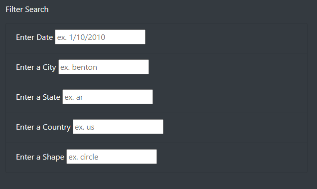
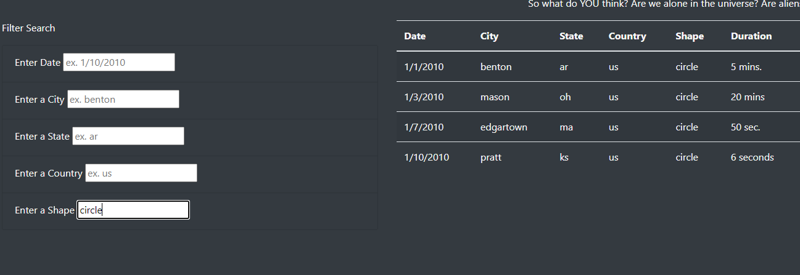

# UFO_Sightings

## Purpose
The purpose of this project was to make the UFO sightings data webpage more dynamic. This allowed the users of the site to perform a more specific, in-depth analysis of the data provided on their own. In addition to the date filter, additional filters for city, state, country, and shape were added.

#### Tools Used
- Javascript
- HTML
- CSS

## How it Works

On the webpage, you are able to now use a total of 5 filters: date, city, state, country, and shape. These display on the bottom left hand side of the page and are shown below.

A user is able to filter the data in the chart to the right of the filters by one or more of the criteria mentioned above. You could do this by simply typing in the constraint you would like to apply. There is no search button, and all you will need to do is simply type in the provided field as show below.

## Summary

There are a few things to be considered moving forward with this project. To start, one drawback of this new design is that there is currently not enough data to make these filters much worth at this time. In the future, it would be best to add in more data, so that when a user searches the state of Arkansas there is more than one result.

Additionally, a way that the design of the page can be improved would be to change the input fields in the filter section to be dropdowns. This would limit the possibility of typos and misspellings causing search issues for the users, and would also provide the users with a selection. It would be recommended that these filters be placed on the state, country, and shape fields.

Lastly, further criteria could be added for duration. It could be possible to have a threshold filter, like greater than 1 minute, 1 hour, etc... This could add further criteria and another data point to be used by users of this site.